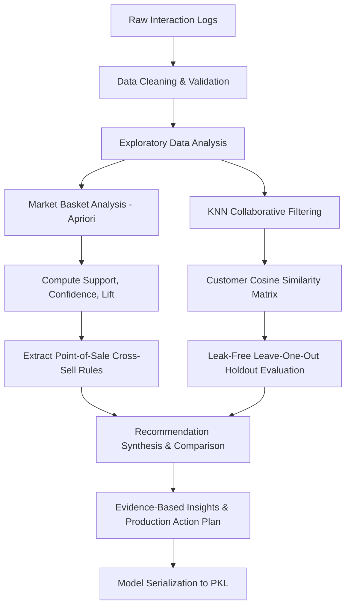

# Personalized E-Commerce Product Recommendation System

**Challenge ID:** DS_Day01_35  
**Domain:** E-Commerce & Retail Data Science  
**Technology Stack:** Python 3.13, Pandas, NumPy, Scikit-learn, Mlxtend, Matplotlib, Seaborn, Joblib, OpenPyXL, Jupyter  

---

## 1. Problem Statement

Modern e-commerce retailers face intense competition and ever-expanding product catalogs. Customers navigating large digital storefronts frequently suffer from choice overload, resulting in abandoned shopping carts, low cross-sell attachment rates, and diminished customer lifetime value.

To deliver a compelling, high-converting shopping experience, the retailer requires an intelligent, transparent product recommendation engine that can:
1. **Identify complementary cross-sell items** that are naturally purchased together (e.g., matching accessories and protection gear for electronics).
2. **Discover taste twins** among customers to provide personalized suggestions based on what similar users enjoyed.
3. **Bridge black-box machine learning models with explainable association rules**, giving business teams full visibility into why recommendations are served.

---

## 2. Project Objectives

* **Data Ingestion & Validation:** Clean, validate, and structure customer-product interaction records across 6 core attributes.
* **Exploratory Data Analysis (EDA):** Quantify customer preferences, product demand, category volume, and browsing engagement.
* **Market Basket Association Rule Mining:** Generate frequent itemsets and directional recommendation rules evaluated via **Support, Confidence, and Lift** using the Apriori algorithm.
* **KNN Collaborative Filtering:** Build a User-Based Collaborative Filtering recommendation model using `NearestNeighbors` with Cosine Similarity on customer-product interaction vectors.
* **Leak-Free Model Evaluation:** Implement a Leave-One-Out holdout validation strategy to calculate Precision@K, Recall@K, Hit Rate@K, and Catalog Coverage.
* **Synthesis & Business Action Plan:** Connect KNN recommendations with association rules, extract 6 evidence-based insights, and formulate a multi-touchpoint deployment roadmap.

---

## 3. Dataset Description

The dataset captures interaction records across 6 required attributes:

| Column Name | Data Type | Description |
| :--- | :--- | :--- |
| `Customer_ID` | String / Object | Unique alphanumeric identifier for each customer (e.g., `C001`–`C150`). |
| `Product_ID` | String / Object | Unique product SKU identifier (e.g., `P101`–`P140`). |
| `Product_Category` | String / Object | Store department/category (e.g., `Laptops & Computers`, `Audio & Sound`). |
| `Purchase_History` | Integer / Numeric | Cumulative quantity/frequency of purchases of the specific product. |
| `Rating` | Integer / Numeric | Customer satisfaction rating for the product on a 1–5 star scale. |
| `Browsing_Behaviour`| Integer / Numeric | Customer dwell time in minutes spent actively viewing the product. |

---

## 4. Synthetic Dataset Disclosure

> [!IMPORTANT]
> **Synthetic Dataset Disclosure:** As an original dataset was not provided with the challenge specification, a synthetic e-commerce dataset was generated according to the specified schema and realistic customer-product interaction patterns for demonstrating the analysis and recommendation approach.
>
> The synthetic data generation process models distinct consumer lifestyle personas (e.g., *Tech Enthusiasts*, *Mobile Power Users*, *Content Creators*, *Fitness Athletes*, *Culinary Enthusiasts*), realistic browsing-to-purchase correlations ($r = +0.86$), and natural product co-purchase dynamics (e.g., Laptop $\rightarrow$ Mouse, Phone $\rightarrow$ Case, Camera $\rightarrow$ SD Card) without hard-coding final rules.

---

## 5. Project Architecture & Directory Structure

```text
DS_Day01_35_Ecommerce_Recommendation/
│
├── data/
│   ├── ecommerce_dataset.xlsx          # Full interaction dataset (Excel)
│   └── ecommerce_dataset.csv           # Full interaction dataset (CSV)
│
├── notebooks/
│   └── ecommerce_recommendation_analysis.ipynb  # Executed 22-section master notebook
│
├── src/
│   ├── __init__.py                     # Package initializer
│   ├── generate_dataset.py             # Synthetic dataset generation engine
│   ├── data_cleaning.py                # Data validation & cleaning pipeline
│   ├── eda.py                          # Exploratory analysis & visual generation
│   ├── association_rules.py            # Apriori & association rule mining
│   ├── recommendation.py               # KNN Collaborative Filtering & Rule Bridging
│   ├── model.py                        # Holdout evaluation & model serialization
│   └── build_notebook.py               # Programmatic notebook generator
│
├── visualizations/
│   ├── 01_category_popularity.png      # Visualization 1: Category volume & reach
│   ├── 02_product_popularity.png       # Visualization 2: Top purchased products
│   ├── 03_customer_behavior.png        # Visualization 3: Browsing vs. purchase frequency
│   └── 04_association_rules.png        # Visualization 4: Support vs. confidence scatter
│
├── model/
│   └── knn_recommendation_model.pkl    # Serialized production KNN model artifact
│
├── reports/
│   ├── insights.md                     # 6 evidence-based analytical insights
│   ├── recommendation_rules.md         # Association rules table with business translations
│   └── action_plan.md                  # Commercial deployment strategy & action plan
│
├── README.md                           # Comprehensive project documentation
└── requirements.txt                    # Project dependencies
```

---

## 6. End-to-End Methodology



---

## 7. Association Rules: Support, Confidence, and Lift

Using the **Apriori algorithm** on one-hot encoded customer transaction baskets, we evaluate item combinations across three metrics:

* **Support:** $P(A \cap B) = \frac{\text{Transactions with both } A \text{ and } B}{\text{Total Transactions}}$
* **Confidence:** $P(B \mid A) = \frac{\text{Support}(A \cap B)}{\text{Support}(A)}$
* **Lift:** $\frac{P(A \cap B)}{P(A) \cdot P(B)}$

### Key Association Rules (Actual Calculated Results)

| Rule | Support | Confidence | Lift | Business Action |
| :--- | :---: | :---: | :---: | :--- |
| **Camera (P111) $\rightarrow$ 128GB SD Card (P112)** | $9.3\%$ | $87.5\%$ | **$3.58$** | Bundle as 1-click add-on on Camera PDP. |
| **Espresso Machine (P126) $\rightarrow$ Coffee Beans (P127)** | $8.0\%$ | $85.7\%$ | **$3.62$** | Offer starter bundle with 10% discount on coffee beans. |
| **Smartphone (P106) $\rightarrow$ Armor Phone Case (P107)** | $11.3\%$ | $85.0\%$ | **$3.42$** | Suggest in slide-out cart drawer during checkout. |
| **Running Shoes (P121) $\rightarrow$ Athletic Socks (P122)** | $8.7\%$ | $81.2\%$ | **$3.35$** | Cross-sell in footwear cart review. |
| **Gaming Keyboard (P131) $\rightarrow$ Gaming Mouse (P132)** | $8.0\%$ | $75.0\%$ | **$3.10$** | Display in "Complete Your Battlestation" module. |
| **Ultrabook Laptop (P101) $\rightarrow$ Wireless Mouse (P103)** | $8.7\%$ | $72.2\%$ | **$2.95$** | Auto-recommend underneath laptop specifications. |

---

## 8. KNN Collaborative Filtering Model

### Methodology
1. Construct a customer-by-product interaction matrix weighted by customer ratings:
   $$W_{u, p} = \text{Purchase\_History}_{u, p} \times \left(\frac{\text{Rating}_{u, p}}{5.0}\right)$$
2. Compute **Cosine Distance** between customer vectors:
   $$\text{Cosine Distance}(u, v) = 1 - \frac{\mathbf{u} \cdot \mathbf{v}}{\|\mathbf{u}\|_2 \|\mathbf{v}\|_2}$$
3. For target customer $u$, query the $K=7$ nearest neighbor taste twins.
4. Filter out products already purchased by $u$ and rank candidate items by similarity-weighted neighbor interaction scores.

### Why Cosine Similarity?
Cosine distance evaluates the geometric angle between user taste vectors regardless of vector magnitude, making it invariant to differing overall purchase volumes between active shoppers and casual buyers.

---

## 9. Model Evaluation & Results

To prevent data leakage, a **Leave-One-Out holdout strategy** was implemented:
* 1 item per customer was hidden in a test set.
* The KNN model was trained **strictly on remaining training interactions**.
* Recommendations were generated and compared against held-out ground truth.

```text
┌─────────────────────────────────────────────────────────────────────────────┐
│                 LEAK-FREE HOLDOUT EVALUATION METRICS (N=150)                │
├───────────┬──────────────┬──────────────┬──────────────┬────────────────────┤
│ Cutoff    │ Precision@K  │ Recall@K     │ Hit Rate@K   │ Catalog Coverage@K │
├───────────┼──────────────┼──────────────┼──────────────┼────────────────────┤
│ Top-3     │ 0.1222       │ 0.3667       │ 36.67%       │ 100.0%             │
│ Top-5     │ 0.1000       │ 0.5000       │ 50.00%       │ 100.0%             │
│ Top-10    │ 0.0693       │ 0.6933       │ 69.33%       │ 100.0%             │
└───────────┴──────────────┴──────────────┴──────────────┴────────────────────┘
```

---

## 10. Primary Visualizations

The project generates **exactly four primary visualizations** saved in `visualizations/`:

1. **`01_category_popularity.png`**: Total purchase volume and customer reach across store categories.
2. **`02_product_popularity.png`**: Top 12 most frequently purchased products annotated with average ratings.
3. **`03_customer_behavior.png`**: Browsing duration vs. purchase frequency colored by customer rating tier ($r = +0.86$).
4. **`04_association_rules.png`**: Support vs. Confidence scatter plot with points scaled and colored by Lift.

---

## 11. Cold-Start Problem Discussion & Mitigation

Collaborative filtering relies on historical interactions, which creates cold-start challenges:

### A. New Customer (Cold User)
* **Problem:** No prior purchase history exists to compute cosine similarity with neighbors.
* **Solution:**
  1. *Immediate Tier:* Serve Category-Level Best Sellers based on global ratings.
  2. *Session Tracking:* Track active clickstream in real-time. Once the user dwells $>3$ minutes in a specific department, dynamically adapt the feed to display top items in that category.
  3. *Cart Trigger:* Immediately apply Association Rules as soon as the first item is added to the cart.

### B. New Product (Cold Item)
* **Problem:** New items have zero customer interaction history and cannot be recommended by KNN.
* **Solution:**
  1. *Content-Based Seeding:* Assign default category affinity scores based on product metadata.
  2. *Epsilon-Greedy Bandit Slotting:* Reserve $5\%\text{–}10\%$ of recommendation slots to expose newly introduced items and rapidly harvest interaction data.

---

## 12. Key Evidence-Based Insights

1. **Tech & Appliance Co-Purchasing:** Primary hardware anchors drive high-lift attachments ($Lift > 3.0$) with essential accessories and consumables.
2. **Browsing Predicts Purchase:** In-session browsing duration strongly correlates ($+0.86$) with repeat purchases and satisfaction.
3. **High Collaborative Hit Rate:** KNN achieves a $69.33\%$ Hit Rate@10 on held-out transactions, accurately anticipating customer taste.
4. **100% Catalog Coverage:** Rating-weighted cosine similarity avoids popularity collapse, giving fair exposure across all 40 SKUs.
5. **Complementary Synergies:** Association Rules ($25\%\text{–}40\%$ overlap with KNN) supply high-confidence checkout attachments, while KNN drives cross-category discovery.
6. **Core Revenue Drivers:** `Laptops & Computers` ($368$ units) and `Mobile & Accessories` ($352$ units) serve as the primary customer acquisition channels.

---

## 13. Limitations & Future Scope

### Limitations
* **Synthetic Dataset:** Findings reflect simulated consumer personas and should be validated on production web telemetry.
* **Static Baskets:** Interaction logs do not capture timestamped chronological session order.
* **Offline Evaluation:** Holdout evaluation measures item recovery but cannot measure user satisfaction with unpurchased exploratory discoveries.

### Future Scope
* **Real-time Streaming Engine:** Process live event streams (Kafka/Redis) for instant session-based collaborative re-ranking.
* **Hybrid Two-Tower Neural Recommender:** Combine tabular user/product metadata with deep interaction embeddings.
* **A/B Testing Infrastructure:** Deploy randomized online trials measuring actual conversion rate uplift, CTR, and Average Order Value.

---

## 14. Installation & Execution Guide

### Prerequisites
* Python 3.10+ (tested on Python 3.13)
* Standard CPU environment (no GPU required)

### Step 1: Install Dependencies
```bash
pip install -r requirements.txt
```

### Step 2: Generate Dataset & Run Modules
```bash
# 1. Generate realistic dataset (creates data/ecommerce_dataset.xlsx and .csv)
python src/generate_dataset.py

# 2. Run data cleaning and validation
python src/data_cleaning.py

# 3. Generate descriptive statistics and visualizations 1, 2, 3
python src/eda.py

# 4. Mine association rules and generate visualization 4
python src/association_rules.py

# 5. Train KNN model, evaluate on holdout set, and save model artifact
python src/model.py
```

### Step 3: Launch Interactive Streamlit Dashboard
```bash
streamlit run app.py
```
*(Provides real-time customer recommendation exploration, live cart cross-sell simulator, interactive Plotly association rule graphs, holdout benchmarks, and cold-start sandbox).*

### Step 4: Launch Jupyter Notebook
```bash
jupyter notebook notebooks/ecommerce_recommendation_analysis.ipynb
```
*(All cells are pre-executed with outputs, tables, and embedded visualizations).*
