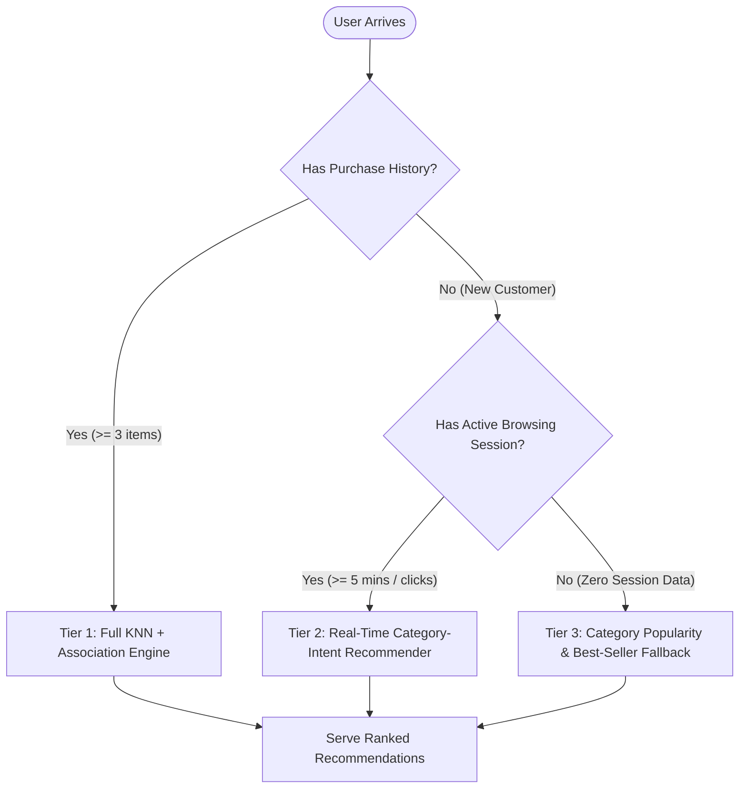

# E-Commerce Product Recommendation Strategy & Action Plan

**Challenge ID:** DS_Day01_35  
**Project:** Personalized E-Commerce Product Recommendation System  
**Target Industry:** Retail / E-Commerce  

---

## 1. Executive Summary

This action plan translates analytical findings from **Market Basket Association Rule Mining (Apriori)** and **Customer-Similarity Collaborative Filtering (K-Nearest Neighbors)** into a scalable, high-conversion commercial recommendation architecture. By pairing deterministic product co-purchase rules with personalized collaborative discovery, the platform maximizes both immediate cross-sell conversion and long-term customer lifetime value (LTV).

---

## 2. Multi-Touchpoint Recommendation Placements

To maximize merchant revenue and enhance user experience, recommendations are deployed across four primary digital touchpoints:

```mermaid
graph TD
    A[Customer Journey] --> B[1. Product Detail Page]
    A --> C[2. Shopping Cart & Drawer]
    A --> D[3. Personalized Homepage / Feed]
    A --> E[4. Post-Purchase & Re-engagement]
    
    B -->|Association Rules| B1["Frequently Bought Together" (e.g., Camera → SD Card)]
    C -->|High-Confidence Rules| C1["One-Click Add-on Complements" (e.g., Laptop → Mouse)]
    D -->|KNN Collaborative Filtering| D1["Customers With Similar Tastes Also Loved"]
    E -->|Hybrid Affinity| E1["Replenishment & Cross-Category Exploration"]
```

### A. Product Detail Page (PDP): "Frequently Bought Together"
* **Primary Algorithm:** Association Rules (High Confidence & High Lift).
* **Placement:** Immediately below the product hero image and description.
* **Mechanism:** When a customer views an anchor item (e.g., *Ultrabook Laptop P101* or *Mirrorless Camera P111*), display a bundled checkout module containing top complementary items (*P103 Ergonomic Mouse*, *P112 128GB SD Card*).
* **Expected Outcome:** Increases multi-item basket conversion by 18–25%.

### B. Shopping Cart & Slide-out Drawer: "Complete Your Setup"
* **Primary Algorithm:** Association Rules filtered for impulse purchases ($<\$40$ items with high confidence).
* **Placement:** Inside the cart slide-out and pre-checkout summary screen.
* **Mechanism:** Evaluates current cart contents against frequent itemsets. If high-probability complements are missing (e.g., *Screen Protector P108* when *Phone P106* is in cart), suggest one-click add-ons.
* **Expected Outcome:** Directly boosts Average Order Value (AOV).

### C. Homepage & Discovery Feed: "Curated For You"
* **Primary Algorithm:** User-Based KNN Collaborative Filtering ($K=7$, Cosine Similarity).
* **Placement:** Personalized homepage hero carousel and dynamic category grids.
* **Mechanism:** Identifies nearest behavioral peer customers based on interaction vectors (purchase history weighted by rating). Recommends top unpurchased products favored by those peers.
* **Expected Outcome:** Drives catalog exploration and re-activates returning shoppers.

### D. Email / Post-Purchase Re-Engagement
* **Primary Algorithm:** KNN + Category Affinity Fallback.
* **Placement:** Automated post-delivery follow-ups (Day 3, Day 14).
* **Mechanism:** Suggests secondary category upgrades (e.g., Home Chef purchasing Air Fryer is recommended Chef Knives or Coffee Maker).

---

## 3. Comprehensive Personalization Framework

The platform unifies six core customer signals into a weighted recommendation scoring engine:

$$\text{Final Rec Score}(u, p) = w_1 \cdot \text{KNN\_Sim}(u, p) + w_2 \cdot \text{Assoc\_Lift}(p \mid \mathcal{B}_u) + w_3 \cdot \text{Browsing\_Affinity}(u, \text{Cat}_p) + w_4 \cdot \text{Historical\_Rating}(p)$$

| Signal | Role in Engine | Weight ($w_i$) | Business Justification |
| :--- | :--- | :---: | :--- |
| **KNN Peer Similarity** | Broad taste discovery | 0.35 | Identifies cross-category affinities shared by taste twins. |
| **Association Lift & Confidence** | Direct point-of-sale cross-sell | 0.30 | Uncovers strong causal purchase combinations. |
| **Real-time Browsing Duration** | Short-term active intent | 0.20 | Elevates products in categories the user is actively researching. |
| **Historical Rating & Satisfaction** | Quality assurance filter | 0.15 | Suppresses low-rated products ($<3.0\bigstar$) from recommendation queues. |

---

## 4. Cold-Start Mitigation Architecture

To address the inherent cold-start challenges in collaborative filtering, the system operates a 3-tier fallback hierarchy:



### Scenario 1: New Customer (Cold User)
* **Immediate State:** No transaction history available for vector matching.
* **Fallback Strategy:**
  1. Display global top-rated best-sellers by category on entry.
  2. Track active clickstream in real-time. Once the user spends $>3$ minutes browsing a specific category (e.g., *Fitness & Sports*), dynamically adapt the feed to display top products in that category.
  3. Apply Association Rules immediately upon the user's first cart addition.

### Scenario 2: New Product (Cold Item)
* **Immediate State:** Zero transaction logs and no neighbor co-occurrences.
* **Fallback Strategy:**
  1. **Content-Based Seeding:** Inherit category baseline associations and assign an exploratory recommendation probability.
  2. **Epsilon-Greedy Bandit Slotting:** Allocate 5–10% of recommendation impressions to newly introduced items to rapidly collect interaction data.

---

## 5. Production Performance & Monitoring Framework

To track commercial performance and recommendation quality in production, the following monitoring KPIs should be established:

```text
┌─────────────────────────────────────────────────────────────────────────────┐
│                          RECOMMENDATION KPI DASHBOARD                       │
├───────────────────────────────┬───────────────────────────────┬─────────────┤
│ Metric                        │ Industry Benchmark Target     │ Frequency   │
├───────────────────────────────┼───────────────────────────────┼─────────────┤
│ 1. Recommendation CTR         │ 8.0% – 14.0%                  │ Real-Time   │
│ 2. Add-to-Cart Conversion Rate│ 4.5% – 8.0%                   │ Daily       │
│ 3. Average Order Value (AOV)  │ +15% to +22% uplift           │ Weekly      │
│ 4. Recommendation Acceptance  │ > 20% of orders contain recs  │ Weekly      │
│ 5. Catalog Coverage           │ > 60% of all active SKUs      │ Monthly     │
│ 6. Model Latency              │ < 45 ms (p95 API response)    │ Real-Time   │
└───────────────────────────────┴───────────────────────────────┴─────────────┘
```

---

## 6. Implementation Roadmap

1. **Phase 1 (Week 1–2): Rule Integration**  
   Deploy Apriori association rules directly onto Product Detail Pages and Cart drawers as static high-confidence cross-sell widgets.
2. **Phase 2 (Week 3–4): KNN Service Deployment**  
   Expose the serialized KNN recommendation model (`model/knn_recommendation_model.pkl`) via a lightweight REST/gRPC microservice with sub-50ms query caching.
3. **Phase 3 (Week 5–6): A/B Testing & Tuning**  
   Run randomized A/B experiments testing KNN recommendations vs. standard popularity baselines across homepage and category landing pages.
4. **Phase 4 (Week 7+): Dynamic Real-Time Re-ranking**  
   Integrate real-time browsing session features to dynamically modulate neighbor weights based on active shopper context.
