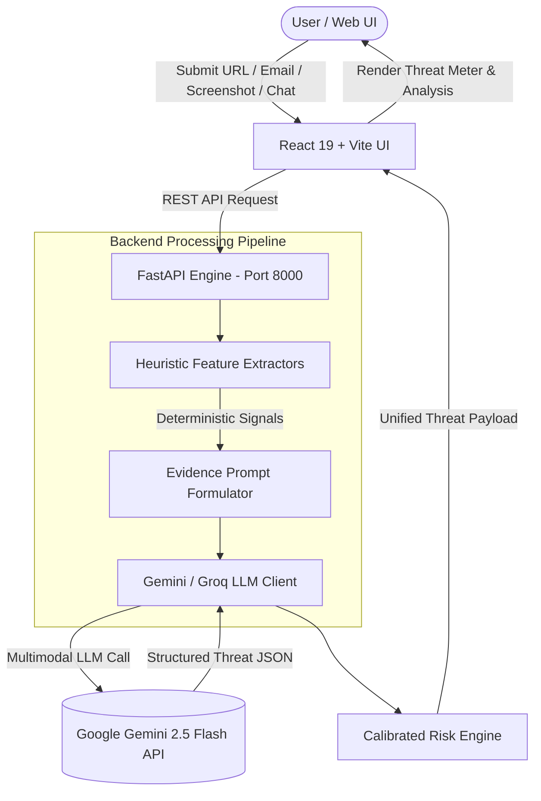

# 🛡️ SentinelAI

> **Next-Generation AI-Powered Cybersecurity Threat Intelligence & Scam Detection Platform**

SentinelAI is a multi-modal cybersecurity analysis platform designed to detect phishing attempts, social engineering scams, malicious URLs, deceptive emails, fraudulent screenshots, and high-risk chat conversations in real-time. Combining **deterministic heuristic feature extractors** with **multimodal AI threat intelligence (Google Gemini)**, SentinelAI delivers calibrated risk scoring, detailed threat breakdowns, and actionable mitigation guidance.

---

## 🌟 Key Features & Scanner Modules

### 🌐 1. URL Threat Intelligence Scanner
- **Heuristic Signal Extraction**: Calculates domain entropy, checks domain length, identifies high-abuse TLDs (`.tk`, `.xyz`, `.ml`), detects raw IP hosts, HTTPS protocol compliance, and suspicious subdomains.
- **Brand Impersonation Detection**: Identifies lookalike domains targeting popular banking, e-commerce, and social media platforms.
- **AI Verification**: Cross-checks heuristic flags with Google Gemini AI to evaluate link destination risk.

### 📧 2. Email Phishing Analyzer
- **Header & Domain Mismatch Audit**: Detects discrepancies between `From` and `Reply-To` headers.
- **Linguistic Threat Analysis**: Identifies high-urgency manipulation phrases, credential harvesting keywords, and financial lure indicators.
- **Embedded Link Profiling**: Extracts and inspects embedded links and host domains.

### 🖼️ 3. Multimodal Screenshot & Vision Scanner
- **UI & Form Inspection**: Leverages vision AI to inspect web page screenshots, login forms, password inputs, and verification banners.
- **Brand Logo & Spoofing Check**: Detects counterfeit login pages mimicking Google, Microsoft, PayPal, and banking portals.
- **Visual Risk Score**: Combines visual cues with text extraction for accurate visual threat detection.

### 💬 4. Scam Conversation & Social Engineering Analyzer
- **Chat Log Profiling**: Analyzes copied chat transcripts from WhatsApp, Telegram, SMS, Instagram, Discord, and Messenger.
- **Tactics Identification**: Detects authority impersonation (Police, Customs, Bank Manager), OTP/PIN/Password theft, UPI collect traps, lottery/job scams, romance fraud, and remote-access lures (AnyDesk/TeamViewer).
- **Extracted Signals**: Automatically identifies phone numbers, UPI IDs, bank details, and suspicious URLs embedded within messages.

### 🤖 5. Interactive Security AI Assistant
- **Real-Time Security Chat**: Provides an interactive cybersecurity chatbot assistant.
- **Incident Guidance**: Delivers instant advice on active threats, security best practices, and emergency response steps.

### 📊 6. Dynamic Threat Meter & Comprehensive Verdict
- **Calibrated Risk Gauge**: Visual `ThreatMeter` categorizing threats into 5 levels: **Safe** (0–20), **Low** (21–40), **Medium** (41–60), **High** (61–80), and **Critical** (81–100).
- **Technical Breakdown**: Displays confidence scores, specific detected threats, input summaries, and step-by-step mitigation instructions.

### 📜 7. Scan Audit History
- Maintains a local audit history of recent scans for easy tracking and review.

---

## 🏗️ Architecture & Technical Stack



| Layer | Technology | Description |
| :--- | :--- | :--- |
| **Frontend** | React 19, Vite 8, CSS | Modern cyber-themed UI with glassmorphism, animated grid, and custom ThreatMeter gauge. |
| **Backend** | Python 3.10+, FastAPI 0.115, Pydantic v2 | High-performance asynchronous REST API backend. |
| **AI Threat Engine** | Google Gemini API (`gemini-2.5-flash`) | Multimodal LLM analysis with fallback support for Groq (`llama-3.3-70b-versatile`). |
| **Feature Extraction** | Custom Python Extractors | Deterministic heuristics for URLs, Emails, Conversations, and Screenshots. |
| **Icons & Styling** | Lucide React, Pure Vanilla CSS | Crisp vector icons and responsive dark-mode cyber design. |

---

## 📁 Project Structure

```
SentinelAI/
├── backend/                        # Python FastAPI Backend Engine
│   ├── main.py                     # API routes, Pydantic models & endpoints
│   ├── gemini_client.py            # Google Gemini & Groq API orchestrator
│   ├── url_extractor.py            # URL heuristic feature extractor
│   ├── email_extractor.py          # Email header & phishing phrase extractor
│   ├── conversation_extractor.py   # Scam & social engineering analyzer
│   ├── screenshot_extractor.py     # Image visual feature extractor
│   ├── test_endpoints.py           # Endpoint integration tests
│   ├── test_comprehensive.py       # Full pipeline test suite
│   ├── requirements.txt            # Python dependencies
│   └── .env.example                # Environment variables template
├── frontend/                       # React + Vite Web Application
│   ├── src/
│   │   ├── components/             # Reusable UI components
│   │   │   ├── Navbar.jsx          # Glassmorphism header navbar
│   │   │   ├── ThreatMeter.jsx     # Dynamic animated risk gauge
│   │   │   ├── PageShell.jsx       # Layout wrapper
│   │   │   └── CyberDecorations.jsx# Cyber background grid & decorations
│   │   ├── pages/                  # Page views
│   │   │   ├── Home.jsx            # Modern landing page dashboard
│   │   │   ├── URLScanner.jsx      # URL scanner page
│   │   │   ├── EmailScanner.jsx    # Email scanner page
│   │   │   ├── ScreenshotScanner.jsx # Screenshot scanner page
│   │   │   ├── ConversationScanner.jsx # Chat/scam conversation scanner
│   │   │   ├── AIAssistant.jsx     # AI cybersecurity chat assistant
│   │   │   ├── Result.jsx          # Detailed scan result view
│   │   │   ├── History.jsx         # Scan history audit log
│   │   │   └── About.jsx           # About page
│   │   ├── App.jsx                 # Main application routing
│   │   └── index.css               # Core styling tokens
│   └── package.json                # Node dependencies
├── start_backend.bat               # One-click Windows script for Backend
├── start_frontend.bat              # One-click Windows script for Frontend
├── screenshots/                    # UI preview screenshots
├── LICENSE                         # MIT License
└── README.md                       # Project documentation
```

---

## 🚀 Quickstart & Setup Guide

### Prerequisites
- **Node.js**: v18.0.0 or higher
- **Python**: v3.10 or higher
- **Google Gemini API Key**: Obtain a free key from [Google AI Studio](https://aistudio.google.com/)

---

### 1. Backend Setup

1. Open a terminal in the `backend` directory:
   ```bash
   cd backend
   ```

2. Create and activate a Python virtual environment:
   ```bash
   # Windows
   python -m venv .venv
   .venv\Scripts\activate

   # Linux / macOS
   python3 -m venv .venv
   source .venv/bin/activate
   ```

3. Install required Python packages:
   ```bash
   pip install -r requirements.txt
   ```

4. Configure your environment variables:
   Copy `.env.example` to `.env` inside the `backend` directory and add your API key:
   ```env
   GEMINI_API_KEY=your_google_gemini_api_key_here
   ```

5. Start the FastAPI server:
   ```bash
   python -m uvicorn main:app --host 127.0.0.1 --port 8000 --reload
   ```
   *The backend will run on `http://127.0.0.1:8000`. API documentation is available at `http://127.0.0.1:8000/docs`.*

---

### 2. Frontend Setup

1. Open a new terminal in the `frontend` directory:
   ```bash
   cd frontend
   ```

2. Install Node dependencies:
   ```bash
   npm install
   ```

3. Launch the Vite development server:
   ```bash
   npm run dev
   ```
   *The web app will open at `http://localhost:5173`.*

---

### ⚡ One-Click Startup (Windows)

You can launch both services quickly using the provided batch files:
- Double-click **`start_backend.bat`** to start the FastAPI server.
- Double-click **`start_frontend.bat`** to start the React frontend.

---

## 🔌 API Endpoints Reference

| Endpoint | Method | Payload | Description |
| :--- | :--- | :--- | :--- |
| `/scan/url` | `POST` | `{ "url": "https://..." }` | Scans link for domain entropy, HTTPS status, TLD risk, and brand spoofing. |
| `/scan/email` | `POST` | `{ "email": "..." }` | Analyzes email headers, urgency flags, and phishing trigger words. |
| `/scan/screenshot` | `POST` | `{ "image_name": "...", "image_data": "base64..." }` | Multimodal visual inspection of website screenshots or login pages. |
| `/scan/conversation` | `POST` | `{ "text": "..." }` | Analyzes chat messages for scam tactics, OTP theft, UPI fraud, and coercion. |
| `/chat` | `POST` | `{ "message": "...", "history": [] }` | Interacts with the AI Security Assistant. |
| `/history` | `GET` | *None* | Retrieves recent scan history logs. |
| `/history/{id}` | `DELETE` | *None* | Removes a specific scan log from history. |

---

## 🧪 Testing

Run the automated backend integration test suite to verify extractor functions and API endpoints:

```bash
cd backend
python test_endpoints.py
python test_comprehensive.py
```

---

## 📈 Roadmap & Development Progress

- [x] **Day 1**: Project idea finalized & repository structure scaffolded (`frontend/`, `backend/`, `ai_model/`, `dataset/`, `docs/`)
- [x] **Day 2**: Requirements finalized, product workflow documented, tech stack decided
- [x] **Day 3**: React + Vite frontend setup & glassmorphism cyber-themed landing page design
- [x] **Day 4 — Backend API Setup**: High-performance FastAPI backend server (`backend/main.py`), CORS middleware, Pydantic schemas, validation error handlers
- [x] **Day 5 — AI Model Integration**: Google Gemini 2.5 Flash API client & model orchestrator (`backend/gemini_client.py`), vision analysis, and deterministic heuristic extractors for URLs, Emails, Screenshots, and Scam Conversations
- [x] **Day 6 — Connect Frontend to Backend**: Full frontend integration with backend endpoints (`/scan/url`, `/scan/email`, `/scan/screenshot`, `/scan/conversation`, `/chat`), dynamic `ThreatMeter` gauge rendering, and live scan audit log
- [x] **Day 7 — Testing & Deployment**: Comprehensive test suite (`test_comprehensive.py`), production build verification (`npm run build`), and one-click startup scripts (`start_backend.bat`, `start_frontend.bat`)

---

## 📄 License

This project is licensed under the [MIT License](LICENSE).
