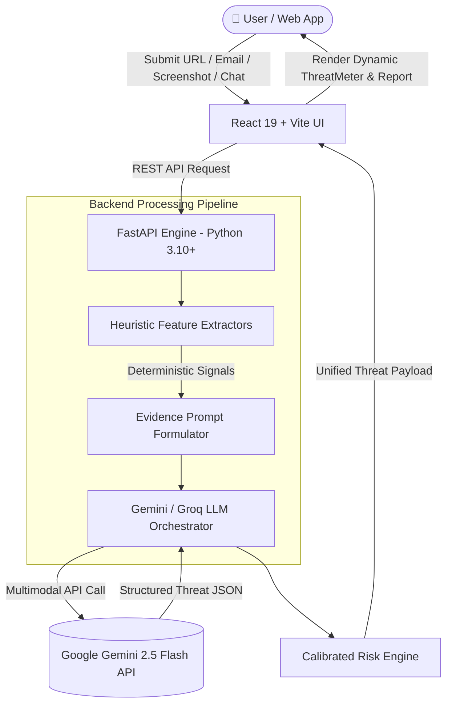

<div align="center">

# 🛡️ SentinelAI
### *Next-Generation Multimodal AI Threat Intelligence & Scam Detection Platform*

[](https://sentinel-fb7gt3bv0-jeffjeromejabez2024cse-7104s-projects.vercel.app)
[](https://sentinelai-k5km.onrender.com/docs)
[](LICENSE)

[](https://react.dev/)
[](https://vitejs.dev/)
[](https://fastapi.tiangolo.com/)
[](https://www.python.org/)
[](https://aistudio.google.com/)
[](#-key-features--scanner-modules)

---

**SentinelAI** is an advanced, multi-modal cybersecurity analysis engine engineered to detect phishing attempts, social engineering scams, malicious URLs, deceptive emails, fraudulent login screenshots, and high-risk chat transcripts in real-time.

Combining **deterministic heuristic feature extractors** with **multimodal AI threat intelligence (Google Gemini 2.5 Flash)**, SentinelAI delivers calibrated risk scoring (0–100), itemized threat breakdowns, and actionable mitigation guidance in milliseconds.

</div>

---

## 🎯 Problem vs. Solution

| The Problem ❌ | SentinelAI Solution 🛡️ |
| :--- | :--- |
| **Complex Multi-Vector Attacks**: Modern scams mix fake screenshots, urgency language, and deceptive links across chat apps. | **Multimodal Intelligence**: Analyzes text, URL structures, email headers, visual screenshots, and chat logs in a unified engine. |
| **Black-Box AI Hallucinations**: Standard LLMs often miss technical domain anomalies or give vague answers. | **Hybrid Heuristics + LLM**: Combines mathematical features (domain entropy, TLD risk, header audit) with Gemini vision & reasoning. |
| **Complex Security Jargon**: Standard virus scanners return raw technical logs that confuse everyday users. | **Calibrated Threat Gauge**: Instant 0–100 visual score with human-readable explanations and step-by-step mitigation actions. |

---

## 🌟 Key Features & Scanner Modules

```
 ┌─────────────────────────────────────────────────────────────────────────────┐
 │                         SENTINEL AI THREAT MODULES                          │
 ├────────────────┬─────────────────┬──────────────────┬───────────────────────┤
 │ 🔗 URL Scanner  │ 📧 Email Audit  │ 🖼️ Vision Scan   │ 💬 Scam Chat Profiler │
 └────────────────┴─────────────────┴──────────────────┴───────────────────────┘
```

### 🌐 1. URL Threat Intelligence Scanner
- **Deterministic Heuristics**: Domain entropy calculation, domain length metrics, high-abuse TLD flag checks (`.tk`, `.xyz`, `.ml`, `.top`), raw IP detection, and HTTPS protocol compliance.
- **Brand Impersonation Engine**: Lookalike domain inspection targeting banking, e-commerce, and social media platforms.
- **AI Verification**: Cross-references heuristic flags with Google Gemini AI to evaluate link destination risk.

### 📧 2. Email Phishing & Header Audit
- **Header Mismatch Audit**: Detects discrepancies between `From` and `Reply-To` headers to catch spoofed senders.
- **Linguistic Threat Extraction**: Flags high-urgency manipulation phrases, credential harvesting lures, and coercion keywords.
- **Embedded Link Profiling**: Extracts and inspects embedded links and host domains automatically.

### 🖼️ 3. Multimodal Screenshot & Vision Scanner
- **Visual Form & UI Inspection**: Uses vision AI to analyze web page screenshots, login forms, password inputs, and fake verification popups.
- **Brand Logo & Spoof Check**: Detects counterfeit login pages mimicking Google, Microsoft, PayPal, and banking portals.
- **Visual Risk Score**: Blends visual layout analysis with OCR text extraction for visual threat detection.

### 💬 4. Scam Conversation & Social Engineering Profiler
- **Chat Transcript Analysis**: Profiles raw chat logs from WhatsApp, Telegram, SMS, Instagram, Discord, and Messenger.
- **Tactics Identification**: Detects authority impersonation (Police, Customs, Bank Manager), OTP/PIN theft, UPI collect traps, lottery/job scams, romance lures, and remote-access software traps (AnyDesk/TeamViewer).
- **Signal Extraction**: Automatically extracts phone numbers, UPI IDs, bank details, and embedded URLs from messages.

### 🤖 5. Interactive Security AI Assistant
- **Real-Time Security Chat**: Conversational AI security assistant trained on cybersecurity best practices.
- **Incident Response Guidance**: Delivers instant advice on active threats, account protection steps, and emergency response.

### 📊 6. Dynamic Calibrated Threat Gauge
- **5-Tier Risk Classification**:
  - 🟢 **Safe** (0–20)
  - 🟡 **Low** (21–40)
  - 🟠 **Medium** (41–60)
  - 🔴 **High** (61–80)
  - 🚨 **Critical** (81–100)
- **Comprehensive Audit Breakdown**: Displays confidence metrics, identified threats, input summaries, and immediate defense steps.

### 📜 7. Scan Audit History Log
- Persistent local history log tracking past threat scans with instant detail modal views.

---

## 🏗️ System Architecture & Data Flow



---

## 🛠️ Technical Stack

| Layer | Technology | Role & Description |
| :--- | :--- | :--- |
| **Frontend** | React 19, Vite 8, React Router v7 | Glassmorphic cyber UI, animated grid, dynamic ThreatMeter gauge. |
| **Styling** | Pure Vanilla CSS | Custom design tokens, modern dark theme, glow effects, responsive layouts. |
| **Backend** | Python 3.10+, FastAPI 0.115, Pydantic v2 | Asynchronous high-throughput REST API with strict request validation. |
| **AI Engine** | Google Gemini API (`gemini-2.5-flash`) | Multimodal LLM analysis with Groq (`llama-3.3-70b-versatile`) fallback. |
| **Extractors** | Custom Python Modules | Deterministic feature extraction for URLs, emails, images, and chat logs. |
| **Hosting** | Vercel (Frontend) + Render (Backend) | Global edge deployment with automatic SSL and CORS protection. |

---

## 📁 Project Structure

```
SentinelAI/
├── backend/                        # Python FastAPI Engine
│   ├── main.py                     # API routes, Pydantic models & CORS setup
│   ├── gemini_client.py            # Gemini 2.5 Flash & Groq LLM client
│   ├── url_extractor.py            # URL heuristic feature extractor
│   ├── email_extractor.py          # Email header & phishing phrase extractor
│   ├── conversation_extractor.py   # Scam & social engineering analyzer
│   ├── screenshot_extractor.py     # Image visual feature extractor
│   ├── test_endpoints.py           # Integration tests
│   ├── test_comprehensive.py       # Full pipeline test suite
│   └── requirements.txt            # Python dependencies
├── frontend/                       # React + Vite Web Application
│   ├── src/
│   │   ├── components/             # Reusable UI components (Navbar, ThreatMeter, PageShell)
│   │   ├── pages/                  # Scanner views (URL, Email, Screenshot, Chat, Assistant, History)
│   │   ├── lib/                    # History storage utilities
│   │   ├── App.jsx                 # Client-side routing
│   │   └── index.css               # Core styling tokens & animations
│   └── package.json                # Node dependencies
├── start_backend.bat               # One-click Windows launcher for Backend
├── start_frontend.bat              # One-click Windows launcher for Frontend
├── LICENSE                         # MIT License
└── README.md                       # Documentation
```

---

## 🚀 Quickstart & Installation

### Prerequisites
- **Node.js**: `v18.0.0` or higher
- **Python**: `v3.10` or higher
- **Google Gemini API Key**: Free key from [Google AI Studio](https://aistudio.google.com/)

---

### 1. Backend Setup

```bash
# 1. Navigate to backend directory
cd backend

# 2. Create and activate virtual environment
python -m venv .venv
# On Windows:
.venv\Scripts\activate
# On Linux/macOS:
source .venv/bin/activate

# 3. Install dependencies
pip install -r requirements.txt

# 4. Create .env file and add your API key
echo GEMINI_API_KEY=your_google_gemini_api_key_here > .env

# 5. Launch FastAPI Backend
python -m uvicorn main:app --host 127.0.0.1 --port 8000 --reload
```
*API docs will be available at `http://127.0.0.1:8000/docs`.*

---

### 2. Frontend Setup

```bash
# 1. Navigate to frontend directory
cd frontend

# 2. Install Node packages
npm install

# 3. Launch Vite Dev Server
npm run dev
```
*Web app will be running at `http://localhost:5173`.*

---

### ⚡ One-Click Startup (Windows)
- Double-click **`start_backend.bat`** to start FastAPI.
- Double-click **`start_frontend.bat`** to start Vite React UI.

---

## 🔌 API Endpoints Reference

| Endpoint | Method | Payload | Description |
| :--- | :--- | :--- | :--- |
| `/scan/url` | `POST` | `{ "url": "https://..." }` | Scans link for domain entropy, HTTPS, TLD risk, and brand spoofing. |
| `/scan/email` | `POST` | `{ "email": "..." }` | Analyzes email headers, urgency flags, and phishing trigger words. |
| `/scan/screenshot` | `POST` | `{ "image_name": "...", "image_data": "base64..." }` | Multimodal visual inspection of screenshots or login pages. |
| `/scan/conversation` | `POST` | `{ "text": "..." }` | Analyzes chat logs for scam tactics, OTP theft, UPI fraud, and coercion. |
| `/assistant/chat` | `POST` | `{ "message": "...", "history": [] }` | Interacts with the AI Security Assistant. |

---

## 📄 License

Distributed under the **MIT License**. See [`LICENSE`](LICENSE) for more information.

---

<div align="center">
  <b>Built for Hackathons with ❤️ by the SentinelAI Team</b>
</div>
